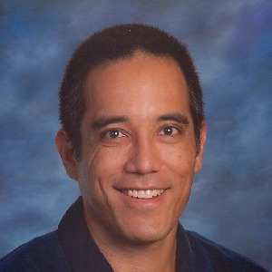

## About these pages

These webpages and programs are fully dependent on open source software.  They
are developed, maintained and hosted on various flavors of the
[Linux](https://www.linuxfoundation.org/) operating system and edited with the
[Vim](http://www.vim.org/) text editor.

The webpages are created with the [Jekyll](https://jekyllrb.com/) static site
generator.  The page content is written in
[Markdown](https://daringfireball.net/projects/markdown/syntax) (a simplified
markup language) with embedded [LaTeX](https://www.latex-project.org/) for the
mathematical equations, which are rendered by
[MathJax](https://www.mathjax.org/).

The programs are written in [Processing](http://www.processing.org), a
simplified Java language and framework for creating computer graphics programs.
The programs are are embedded in the web pages using
[Processing.js](http://processingjs.org/).

I will be making all source code available in the future -- stay tuned.

## About the author

{width=120px} 

[Dr. Darren Kessner](mailto:Darren.Kessner@marlborough.org) teaches math and
computer science and serves as Co-Head of the [STEM+
Program](http://stem.marlborough.org) at [Marlborough
School](http://marlborough.org), an independent all-girls school in Los
Angeles.  Dr. Kessner oversees the Computer Science curriculum at Marlborough,
and also works with faculty in the Math, Science, and Visual Arts departments
to include computational thinking and coding in other classes.  Dr. Kessner
also supervises students in their research and interdisciplinary projects
involving computer science and engineering.  

In addition to having taught at the high school and college levels, Dr. Kessner
has 20 years of experience as a software developer in various fields, including
computer security, computer graphics, and scientific applications.  He has
published several scientific papers and open source software projects, and
regularly runs computer workshops for teachers and research scientists.  

